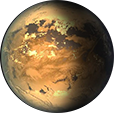
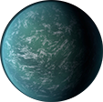
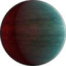
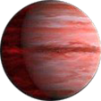

# exoplanetjs

[](https://travis-ci.org/code-for-coffee/exoplanet.js)

Collection of Javascript files and functions for use with Exoplanet data parsing/rendering/conversion.

## Usage

```javascript
var exoplanetjs = require('exoplanetjs');
exoplanetjs.getPlanetType(0.42);  // => 'Subterran'
exoplanetjs.getPlanetType(500);   // => 'Jovian'
exoplanetjs.PlanetTypesListModel['Superterran'] // =>
/* Superterran: {
	minMass: 2.00001,
	maxMass: 10,
  desc: 'Superterrans are able to hold dense atmospheres with liquid water within the habitable zone.'
} */
```

## Work in Progress

There is still very limited functionality to this project. More documentation will be added as we go.

## Exoplanet Assets

Included in this project are various exoplanet resources. These have been sources from data found on NASA and ESA websites.

 Asteroidan Planet

 Mercurian Planet

 Subterran Planet

 Terran Planet

 Superterran Planet

 Neptunian Planet

 Jovian Planet
